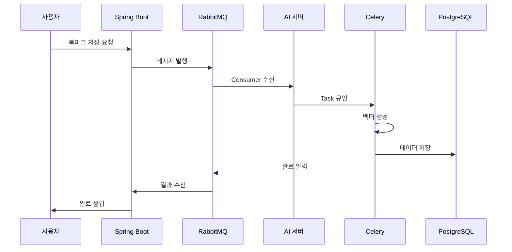
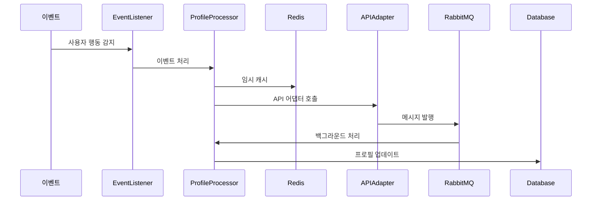

# Nebula AI 시스템 아키텍처

## 개요

Nebula AI는 AI 기반 북마크 저장 및 사용자 프로필 관리 시스템으로, 마이크로서비스 아키텍처와 CQRS 패턴을 기반으로 구축된 확장 가능한 플랫폼입니다.

## 시스템 구성

### 전체 아키텍처 개요

```
┌─────────────────┐    HTTP API    ┌─────────────────┐
│   Spring Boot   │ ──────────────► │   AI Server     │
│    서버         │                │  (FastAPI)      │
│                 │                │                 │
│ - 사용자 인증   │                │ - 프로필 분석   │
│ - 웹 인터페이스 │                │ - 추천 엔진     │
│ - 데이터 관리   │                │ - 벡터 처리     │
└─────────────────┘                └─────────────────┘
                                            │
                                            │ RabbitMQ
                                            ▼
                   ┌─────────────────────────────────────────────┐
                   │           메시지 큐 시스템                   │
                   │                                             │
                   │  ┌─────────────┐  ┌─────────────┐          │
                   │  │  북마크     │  │   프로필    │          │
                   │  │  저장 큐    │  │  업데이트큐 │          │
                   │  └─────────────┘  └─────────────┘          │
                   └─────────────────────────────────────────────┘
                                            │
                                            │ Celery
                                            ▼
                   ┌─────────────────────────────────────────────┐
                   │         백그라운드 작업 처리                │
                   │                                             │
                   │  ┌─────────────┐  ┌─────────────┐          │
                   │  │  벡터 생성  │  │  유사도     │          │
                   │  │   작업      │  │  계산 작업  │          │
                   │  └─────────────┘  └─────────────┘          │
                   └─────────────────────────────────────────────┘
                                            │
                                            ▼
                   ┌─────────────────────────────────────────────┐
                   │            데이터 저장소                    │
                   │                                             │
                   │  ┌─────────────┐  ┌─────────────┐          │
                   │  │ PostgreSQL  │  │    Redis    │          │
                   │  │  (메인 DB)  │  │   (캐시)    │          │
                   │  └─────────────┘  └─────────────┘          │
                   └─────────────────────────────────────────────┘
```

## 핵심 아키텍처 패턴

### 1. CQRS (Command Query Responsibility Segregation)

사용자 프로필 시스템은 CQRS 패턴을 통해 읽기와 쓰기를 분리하여 성능과 확장성을 보장합니다.

#### Command Side (쓰기)
```
Spring Boot → RabbitMQ → AI Server → 비동기 처리 → 데이터 저장
```

**특징:**
- 모든 업데이트 작업은 메시지 큐를 통해 비동기 처리
- 원자적 연산과 이벤트 소싱 지원
- 높은 처리량과 안정성 보장

#### Query Side (읽기)
```
Spring Boot → FastAPI 직접 호출 → 즉시 응답
```

**특징:**
- 실시간 조회 API 제공
- 캐시 기반 빠른 응답
- 읽기 전용 최적화된 데이터 구조

### 2. 이벤트 기반 아키텍처

#### 이벤트 플로우
```
사용자 행동 → 이벤트 발생 → 메시지 큐 → 이벤트 처리 → 상태 업데이트
```

**주요 이벤트:**
- 북마크 저장 이벤트
- 채팅 세션 완료 이벤트
- 프로필 품질 체크 이벤트
- 추천 갱신 이벤트

### 3. 마이크로서비스 패턴

#### Spring Boot 서버 (사용자 인터페이스)
- **역할**: 웹 인터페이스, 인증, 세션 관리
- **기술**: Java, Spring Boot, MySQL
- **책임**: 사용자 경험, 데이터 무결성

#### AI 서버 (데이터 처리)
- **역할**: AI 분석, 벡터 처리, 추천 엔진
- **기술**: Python, FastAPI, PostgreSQL
- **책임**: 머신러닝, 자연어 처리, 벡터 연산

## 데이터 플로우

### 1. 북마크 저장 플로우



### 2. 실시간 프로필 업데이트 플로우



## 기술 스택

### 백엔드 서비스

#### AI 서버 (Python)
- **프레임워크**: FastAPI
- **비동기 처리**: Celery + Redis
- **메시지 큐**: RabbitMQ (aio-pika)
- **ML/AI**: OpenAI API, NLTK, scikit-learn
- **벡터 DB**: Chroma, PostgreSQL + pgvector

#### Spring Boot 서버 (Java)
- **프레임워크**: Spring Boot
- **데이터베이스**: MySQL
- **인증**: Spring Security
- **API 통신**: RestTemplate/WebClient

### 인프라 구성요소

#### 메시지 큐 시스템
```python
# 주요 큐 구성
QUEUES = {
    "bookmark.save": "북마크 저장 처리",
    "profile.update": "프로필 실시간 업데이트", 
    "profile.refresh": "프로필 배치 갱신",
    "recommendation.refresh": "추천 시스템 갱신",
    "analytics": "분석 작업"
}
```

#### 데이터베이스 구성
- **PostgreSQL**: 메인 데이터 저장소 (벡터 데이터 포함)
- **Redis**: 캐시 및 세션 저장소
- **MySQL**: Spring Boot 서버 데이터
- **Chroma**: 벡터 유사도 검색

## 보안 및 성능

### 보안 아키텍처

#### 인증/권한
- **Spring Boot**: JWT 기반 인증
- **AI 서버**: API 키 기반 접근 제어
- **내부 통신**: 메시지 큐를 통한 안전한 통신

#### 데이터 보호
- **개인정보 마스킹**: 채팅 데이터 자동 마스킹
- **암호화**: 중요 데이터 암호화 저장
- **접근 제어**: 사용자별 데이터 접근 권한

### 성능 최적화

#### 캐싱 전략
```python
# 다층 캐싱 구조
CACHE_LAYERS = {
    "L1": "Redis (빠른 접근)",
    "L2": "PostgreSQL (영구 저장)",
    "L3": "벡터 DB (유사도 검색)"
}
```

#### 비동기 처리
- **실시간**: 중요한 업데이트 즉시 처리
- **배치**: 대량 데이터 효율적 처리
- **스케줄링**: 시스템 부하 분산

## 확장성 및 모니터링

### 수평 확장
- **Celery Worker**: 독립적 스케일링
- **AI 서버**: Load Balancer를 통한 다중 인스턴스
- **데이터베이스**: 읽기 복제본 활용

### 모니터링 도구
- **RabbitMQ Management**: 큐 상태 모니터링
- **Flower**: Celery 작업 모니터링
- **Prometheus + Grafana**: 시스템 메트릭
- **로그 집계**: 중앙화된 로그 관리

### 장애 복구
- **Circuit Breaker**: 서비스 장애 격리
- **Retry Logic**: 자동 재시도 메커니즘
- **Dead Letter Queue**: 실패한 메시지 처리
- **Health Check**: 서비스 상태 자동 감지

## 데이터 모델

### 핵심 엔티티

#### UserProfile (사용자 프로필)
```python
{
    "user_id": "사용자 식별자",
    "profile_vector": "768차원 벡터",
    "last_updated": "마지막 업데이트 시간",
    "quality_score": "프로필 품질 점수",
    "metadata": "추가 메타데이터"
}
```

#### Bookmark (북마크)
```python
{
    "bookmark_id": "북마크 식별자",
    "user_id": "소유자",
    "title": "제목",
    "url": "URL",
    "vector_embedding": "콘텐츠 벡터",
    "keywords": "키워드 리스트",
    "similarity_score": "유사도 점수"
}
```

## 개발 및 배포

### 개발 환경
```bash
# 로컬 개발 환경 구성
make local                    # 전체 서비스 시작
make test-all                # 통합 테스트
make dev-setup               # 개발 환경 설정
```

### 배포 전략
- **개발**: Docker Compose 기반
- **스테이징**: Kubernetes 클러스터
- **프로덕션**: 클라우드 네이티브 배포

### CI/CD 파이프라인
1. **코드 커밋** → GitHub
2. **자동 테스트** → pytest, 통합 테스트
3. **빌드** → Docker 이미지
4. **배포** → 환경별 자동 배포

## 향후 발전 방향

### 단기 계획 (3개월)
- 추천 엔진 고도화
- 성능 메트릭 대시보드
- A/B 테스트 프레임워크

### 중기 계획 (6개월)
- 머신러닝 파이프라인 자동화
- 다중 테넌트 지원
- 고급 분석 기능

### 장기 계획 (1년)
- AI 모델 자체 훈련
- 실시간 개인화
- 글로벌 확장

이 아키텍처는 확장성, 안정성, 성능을 모두 고려하여 설계되었으며, 지속적인 개선을 통해 더욱 정교한 시스템으로 발전할 예정입니다. 