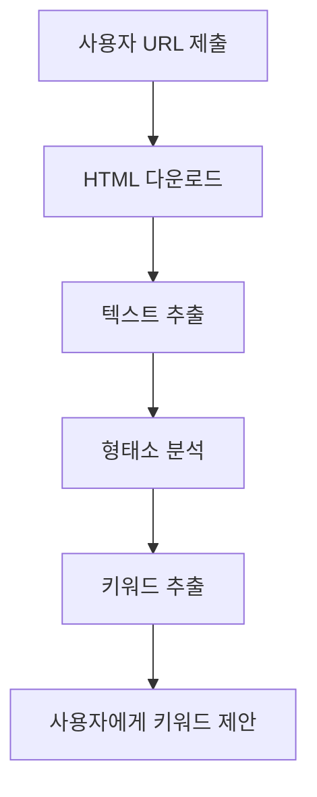
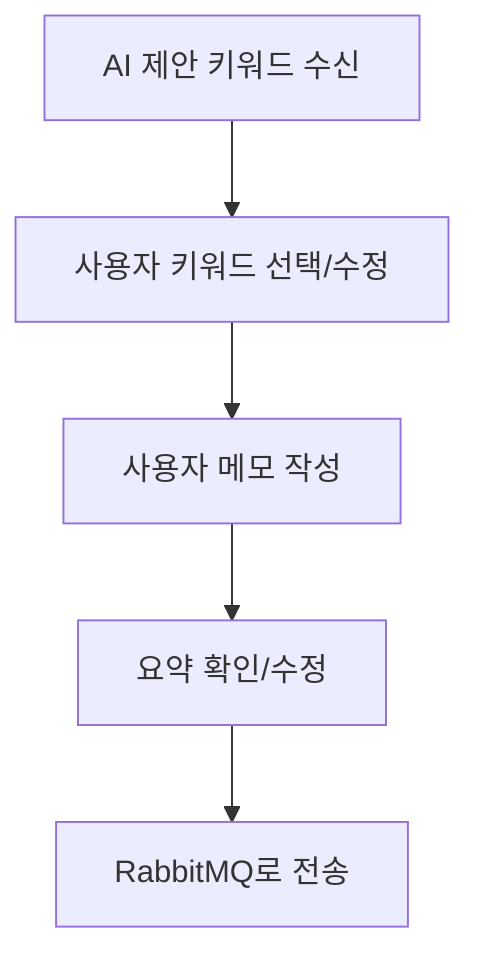
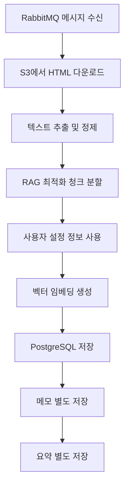

# 북마크 저장 워크플로우

## 📋 전체 프로세스 개요

Nebula AI 북마크 시스템의 완전한 워크플로우를 설명합니다.

## 🔄 3단계 워크플로우

### 1단계: AI 서버의 일차 키워드 추출
**담당**: `NebulaNLPExtractor` (app/tasks/data_extractor_nlp.py)



**기능:**
- HTML에서 텍스트 추출
- 형태소 분석기로 명사 추출 (한국어: Okt, 영어: NLTK)
- 불용어 제거 (596개 한국어 + NLTK 영어)
- 상위 키워드 3개 추출하여 사용자에게 제안

**코드:**
```python
class NebulaNLPExtractor:
    async def extract_and_process(self, request):
        # 1. HTML 텍스트 추출
        text_content = self._extract_text_content(soup)
        
        # 2. AI가 키워드 일차 추출
        suggested_keywords = await self._extract_keywords_tfidf(text_content, max_keywords=3)
        
        # 3. 사용자에게 제안 키워드 반환
        return {
            'suggested_keywords': suggested_keywords,
            'content': text_content,
            'title': title,
            # ... 기타 메타데이터
        }
```

### 2단계: 사용자의 최종 선택 및 전송
**담당**: 프론트엔드 + RabbitMQ



**사용자 액션:**
- AI가 제안한 키워드 중 선택
- 필요시 키워드 추가/수정
- 개인 메모 작성
- 요약 확인/수정

**RabbitMQ 메시지 구조:**
```python
{
    "userId": 123,
    "starId": "bookmark_uuid",
    "s3Key": "path/to/html",
    "title": "사용자가 설정한 북마크 제목",      # 사용자 제목
    "url": "https://example.com",            # 원본 URL
    "keywords": ["AI", "머신러닝", "딥러닝"],  # 사용자 최종 선택
    "memo": "나중에 공부할 중요한 자료",      # 사용자 메모
    "summary": "AI 기술에 대한 개요"         # 사용자 확인 요약
}
```

### 3단계: AI 서버의 저장 처리
**담당**: `bookmark_save_task` (app/tasks/bookmark_save_task.py)



**기능:**
- 사용자 선택 정보를 받아서 **저장만** 수행
- HTML에서 추가 정보 추출 안 함 (사용자 설정 정보만 사용)
- RAG에 최적화된 다층 저장 구조
- 사용자 컨텍스트 100% 보존

**코드:**
```python
def _save_bookmark_logic(user_id, star_id, s3_key, title, url, keywords, memo, summary):
    """
    사용자가 최종 선택한 정보를 받아서 벡터 DB에 저장
    - title: 사용자가 설정한 북마크 제목
    - url: 원본 URL (사용자 제공)
    - keywords: 사용자가 선택한 최종 키워드
    - memo: 사용자 개인 메모
    - summary: 사용자가 확인한 요약
    """
    
    # HTML에서 텍스트만 추출 (제목, URL 등은 추출 안 함)
    body_text = extract_main_text(html)
    
    # 1. 콘텐츠 청크 저장 (RAG 검색용)
    for chunk_data in rag_chunks:
        await vector_service.save_document(
            source_type="bookmark_chunk",
            content=chunk_data["content"],
            title=title,        # 사용자 설정 제목
            url=url,           # 사용자 제공 URL
            keywords=keywords,  # 사용자 선택 키워드만
            extra_metadata=chunk_metadata
        )
    
    # 2. 사용자 메모 별도 저장 (높은 우선순위)
    if memo:
        await vector_service.save_document(
            source_type="bookmark_memo",
            content=f"사용자 메모: {memo}",
            title=f"[메모] {title}",  # 사용자 제목 사용
            keywords=keywords         # 사용자 키워드만
        )
    
    # 3. 요약 별도 저장 (개요 파악용)
    if summary:
        await vector_service.save_document(
            source_type="bookmark_summary", 
            content=f"문서 요약: {summary}",
            title=f"[요약] {title}",  # 사용자 제목 사용
            keywords=keywords         # 사용자 키워드만
        )
```

## 🎯 핵심 특징

### AI 서버의 역할 분리
1. **1단계**: 키워드 추출 및 제안 (AI 판단)
2. **3단계**: 사용자 선택 정보 저장 (단순 저장)

### 사용자 중심 설계
- AI는 제안만, 최종 결정은 사용자
- 사용자 메모와 키워드 선택권 보장
- 개인화된 검색 경험 제공

### RAG 최적화
- 사용자 설정 정보 100% 반영 (제목, URL, 키워드, 메모)
- HTML 파싱 추가 정보 추출 안 함
- 다층 저장 구조 (콘텐츠/메모/요약)
- 풍부한 메타데이터 포함

## 📊 시스템 장점

### 효율성
- AI는 복잡한 분석 작업만 수행
- 사용자 선택 후에는 단순 저장만
- HTML 파싱으로 인한 오버헤드 제거
- 명확한 책임 분리

### 사용자 경험
- AI 제안으로 편의성 제공
- 최종 선택권은 사용자에게
- 사용자 설정 정보 100% 보존
- 개인 메모로 맞춤화

### 검색 품질
- 사용자 의도가 100% 반영된 키워드
- 사용자 설정 제목으로 명확한 식별
- 개인 메모의 높은 검색 우선순위
- RAG에 최적화된 구조

## 🚀 메시지 플로우

```
[프론트엔드] → [NLP 추출기] → [사용자 선택] → [RabbitMQ] → [저장 태스크] → [PostgreSQL]
      ↓              ↓               ↓            ↓             ↓              ↓
   URL 제출    키워드 제안      최종 선택    메시지 전송    벡터 저장      RAG 검색
```

## 📝 구현 상태

✅ **완료된 기능**
- AI 키워드 일차 추출
- RabbitMQ 메시지 처리
- 사용자 선택 정보 저장
- RAG 최적화 저장 구조

✅ **최적화된 부분**
- 형태소 분석기 기반 키워드 추출
- 다층 저장 구조 (콘텐츠/메모/요약)
- 사용자 컨텍스트 보존
- 메타데이터 풍부화

이 워크플로우를 통해 Nebula AI는 AI의 효율성과 사용자의 개인화를 모두 만족하는 북마크 시스템을 제공합니다. 